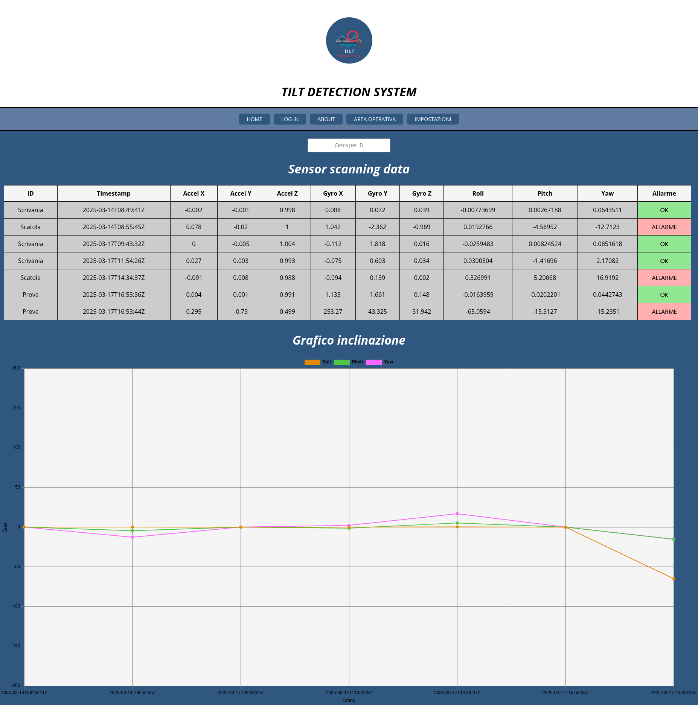

# Tilt Detection System – Embedded C++ + Node.js Server + Web Interface

A complete system for tilt detection using the MPU6050 sensor with a Raspberry Pi 5.  
This project includes:
- C++ embedded code for sensor data acquisition
- Node.js server with REST API
- A static HTML+JS frontend served via Express

---

## Repository Structure

 `main` branch: current working version  
`reactjs-version` branch: previous version with React interface

---

## Development Environment

- **Host machine**: Ubuntu 24.04 (amd64)
- **Target machine**: Raspberry Pi 5 (Debian 12 – arm64)
- **IDE**: Visual Studio Code

---

## Toolchain

- **Compilers**: `aarch64-linux-gnu-gcc/g++-12`
- **Libraries**: `i2c`, `curl`, `pthread`
- **Build system**: CMake

---

## Embedded Code (Example.cpp)

- **Language**: C++
- **Description**:
  - Initializes MPU6050 (3 axys accelerometer + 3 axys gyroscope)
  - Computes offsets
  - Reads raw sensor data and calculates tilt angles
  - Packs data into a JSON object
  - Sends it to the server using a `POST` HTTP request via `curl`

---

## Backend + Frontend

### Stack
- **Languages**: JavaScript (Node.js + Express), HTML/CSS
- **Runtime**: Node.js
- **Security**: TLS encryption over HTTPS
- **Real-time updates**: socket.io (bidirectional, real-time and low latency communication)

### Communication Flow

#### C++ → Node.js (POST)
- The embedded client sends a JSON payload to `/data`

#### Node.js → Browser (WebSocket)
- The server forwards real-time data to connected clients via socket.io. Data contained in the chart and table will update every time a new JSON payload is received.

#### Browser → Node.js (GET)
- The browser sends a `GET` request to `/` and receives the `index.html`
- The page includes:
  - A table displaying all received tilt data
  - A live-updating chart
  - Filter by ID
  - Visual alerts when thresholds are exceeded

---

## Web page preview

